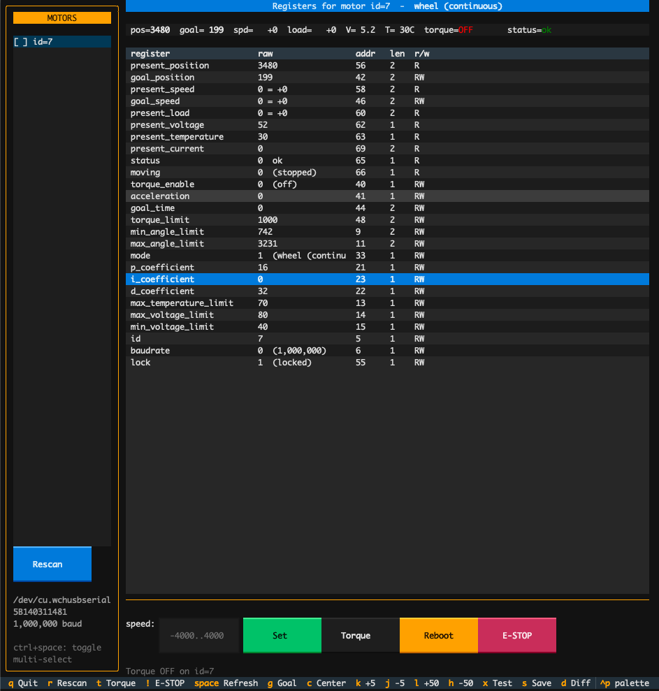

# sts-suite


Terminal debugger for Feetech STS3215 smart serial bus servos.

<!-- Screenshot goes here -->


## Requirements

- Python 3.10 or newer
- A USB-to-TTL adapter wired to the servo bus

## Install

```bash
git clone https://github.com/pham-tuan-binh/sts-suite.git
cd ./sts-suite
uv sync
```

## Run

```bash
uv run sts
```

Pick a serial port and baud rate. The debugger opens. The last choice is saved to `~/.cache/sts-suite/last.json`.

If no motors respond, hit `Baud sweep` in the port picker and it will try every preset and pick the one with the most motors.

## Main screen

Left sidebar: motors on the bus. Toggle multi-select with `ctrl+space`; goal and nudge then drive the whole selection via `sync_write` in one packet.

Right side: a watch strip with the always-visible vitals, then the full register table. `Enter` on any RW row pops an edit modal with a description, range, units, and a dropdown for enum registers.

## Screens

| Key      | Screen                                              |
| -------- | --------------------------------------------------- |
| `?`      | Help overlay                                        |
| `o`      | Oscilloscope: live plot of position / speed / load / current |
| `w`      | Waveform generator: sine, square, triangle, step    |
| `v`      | Grid view: every motor on one screen                |
| `d`      | Diff against a saved state snapshot                 |
| `Ctrl+L` | Preset loader: apply a JSON of register values      |

## Keybindings

| Key          | Action                                          |
| ------------ | ----------------------------------------------- |
| `q`          | Quit                                            |
| `r`          | Rescan bus                                      |
| `t`          | Toggle torque on selected (or all selected)     |
| `!`          | E-STOP: broadcast torque off to every motor     |
| `space`      | Full refresh                                    |
| `Ctrl+Space` | Toggle multi-select on highlighted motor        |
| `g`          | Focus goal / speed input                        |
| `k` / `j`    | Nudge +5 / -5 (auto-scales per mode)            |
| `l` / `h`    | Nudge +50 / -50                                 |
| `c`          | Center: goal to 2048 or speed to 0              |
| `Enter`      | Edit selected register (RW only)                |
| `x`          | Movement test on selected motor                 |
| `s`          | Save JSON snapshot of every motor               |
| `Ctrl+R`     | Reboot selected motor                           |

## Modes

The control bar adapts to the selected motor's `mode` register.

| Mode | Name                   | Target        | Range            | Nudge scale |
| ---- | ---------------------- | ------------- | ---------------- | ----------- |
| 0    | position (servo)       | goal_position | 0 to 4095        | 1           |
| 1    | wheel (continuous)     | goal_speed    | -4000 to 4000    | 10          |
| 2    | PWM (open-loop)        | goal_speed    | -1000 to 1000    | 5           |
| 3    | step                   | goal_position | -32768 to 32767  | 20          |

## Status register

Bit flags decoded in the register table and watch strip.

| Tag     | Meaning                  |
| ------- | ------------------------ |
| `VOLT`  | voltage out of range     |
| `ANGLE` | angle limit exceeded     |
| `HOT`   | overheat                 |
| `CURR`  | overcurrent              |
| `OVLD`  | overload                 |

## Snapshot file

`s` writes `sts-state-YYYYMMDD-HHMMSS.json` in the current directory with every register value for every motor on the bus. Load one with `d` to diff against the current live readings.

## Preset file

Presets live in any JSON file with a top-level `registers` map:

```json
{
  "registers": {
    "p_coefficient": 32,
    "i_coefficient": 0,
    "d_coefficient": 0,
    "torque_limit": 800,
    "acceleration": 30,
    "max_temperature_limit": 70
  }
}
```

`Ctrl+L` applies every RW field to the selected motor; EEPROM fields are unlocked and re-locked automatically.

## Performance

- Live tick reads SRAM 40-70 in one `read_raw_data` call (single round trip per refresh).
- Full refresh reads EEPROM 0-39 plus SRAM 40-70 as two bulk reads instead of 26.
- Serial I/O runs in a worker thread; a stuck motor can't freeze the UI.
- Multi-motor writes use `sync_write_raw_data` so N motors update in one packet.

## Stack

- [Textual](https://github.com/Textualize/textual) and [textual-plotext](https://github.com/Textualize/textual-plotext) for the UI
- [rustypot](https://github.com/pollen-robotics/rustypot) for the Feetech protocol over serial

## License

Apache License 2.0. See [LICENSE](LICENSE).
